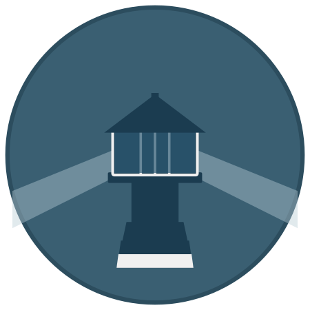

<p style="text-align: center; margin-left: 1.6rem;">
  
</p>
<h1 align="center">
  Watch-Tower-NG
</h1>

<p align="center">
  A Rust rewrite of Watchtower — automated Docker container base image updates.
  <br/><br/>
  <a href="https://github.com/wiki-mod/Watch-Tower-NG/actions/workflows/ci.yml">
    
  </a>
  <a href="https://www.apache.org/licenses/LICENSE-2.0">
    
  </a>
  <a href="https://github.com/wiki-mod/Watch-Tower-NG/releases">
    
  </a>
  <a href="https://github.com/wiki-mod/Watch-Tower-NG/pkgs/container/watchtower-ng">
    
  </a>
</p>

## Quick Start

With Watch-Tower-NG you can update the running version of your containerized app simply by pushing a new image to your
registry. Watch-Tower-NG will pull down the new image, gracefully shut down the existing container,
and restart it with the same options that were used when it was deployed initially.

=== "docker run"

    ```bash
    $ docker run -d \
    --name watchtower \
    -v /var/run/docker.sock:/var/run/docker.sock \
    ghcr.io/wiki-mod/watchtower-ng
    ```

=== "docker-compose.yml"

    ```yaml
    services:
      watchtower:
        image: ghcr.io/wiki-mod/watchtower-ng
        volumes:
          - /var/run/docker.sock:/var/run/docker.sock
    ```
